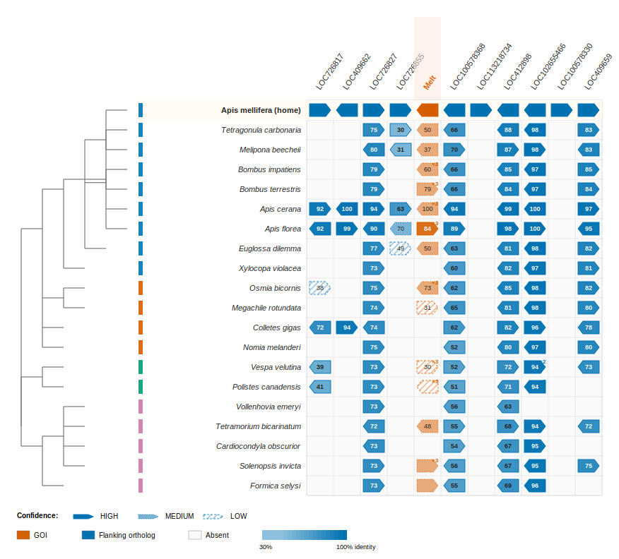

<h1 align="center">SynVoy &mdash; Synteny Voyager</h1>

<p align="center">
  <em>Find orthologous genes that BLAST can't.</em>
</p>

<p align="center">
  <a href="https://github.com/AndreasWz/SynVoy/actions/workflows/test.yml"></a>
  <a href="https://www.gnu.org/licenses/agpl-3.0"></a>
  
</p>

---

## What SynVoy does

SynVoy is a Nextflow pipeline for finding **orthologous genes across evolutionary distances** when standard sequence-similarity searches fail — for example, on highly divergent toxins or short micro-exon genes.

Instead of relying on the gene's sequence alone, it uses the **conserved order of its neighbouring genes (macro-synteny)** to locate the right genomic neighbourhood in target species, then runs a localised search inside that region.

> **Concrete example.** Give SynVoy the UniProt accession for honeybee melittin and a list of bee genomes. It locates melittin's neighbourhood in *Apis mellifera*, finds the homologous neighbourhood in each target genome by mapping the flanking genes, and recovers the divergent melittin orthologs that pure BLAST/MMseqs2 misses.
>
> **Validated finding.** Run with melittin against ant genomes, SynVoy independently re-finds **U11-myrmicitoxin-Tb1a** (UniProt `A0A6M3Z554`) at the right locus in *Tetramorium bicarinatum* — a 26 % identity hit that standard homology search drops, but synteny correctly anchors. This is a known myrmicitoxin from the same melittin-derived family.

<p align="center">
  
</p>
<p align="center"><sub><b>Matrix view</b> — melittin orthologs across 19 bee + outgroup genomes. Each row is a species; each column is a home-genome flanking-gene slot, with the GOI ("Melt") highlighted. Cell shading encodes confidence: <b>solid</b> = HIGH, <b>lightly dotted</b> = MEDIUM, <b>hatched</b> = LOW (likely false positive). The cladogram on the left is an NCBI-taxonomy species tree colour-grouped into Hymenoptera families (Apinae, other bees, Vespidae, Formicidae).</sub></p>

<details>
<summary><b>Track view</b> (per-locus arrow plot — click to expand)</summary>

<p align="center">
  
</p>
<p align="center"><sub><b>Track view</b> (interactive HTML; static SVG export shown). Same melittin run as above, but per-locus: each species gets a horizontal track of gene arrows, ribbons connect orthologous flanking genes between adjacent species, and resolved vs. ambiguous GOIs are visually distinct (solid red = resolved, hatched red = ambiguous family member). Open the live HTML for tooltips on hover, left-click on a gene to highlight its orthologs across all tracks, and right-click to pin a label for that gene.</sub></p>

</details>

---

## When to use SynVoy

| Scenario | Use SynVoy? |
|---|---|
| Standard tblastn / MMseqs2 already finds clean orthologs | No — you don't need it. |
| Target gene is short / micro-exon / highly divergent | **Yes** — synteny anchors the search. |
| Targets are unannotated / freshly assembled genomes | **Yes** — Pro Mode handles raw FASTA. |
| You need ortholog vs. paralog resolution within a family | **Yes** — `--expand_goi_similar` includes paralogs in the tree. |
| Whole-genome ortholog inference across many species | Use OrthoFinder / TOGA — SynVoy is gene-centric. |

---

## Quick install

Requires Linux/macOS, Conda or Mamba, and Java ≥17 (Conda will pull it in).

```bash
git clone https://github.com/AndreasWz/SynVoy.git
cd SynVoy
mamba env create -f environment.yml      # or: conda env create -f environment.yml
conda activate synvoy_env
nextflow -version                         # sanity check
```

Full step-by-step setup, Docker/Singularity instructions, and verification commands live in **[docs/INSTALL.md](docs/INSTALL.md)**.

---

## Quick start

> **New here?** Follow **[docs/QUICKSTART.md](docs/QUICKSTART.md)** for a 20–30 min end-to-end walkthrough on melittin against NCBI-fetched bee genomes — no local data needed.

### Easy Mode (automated genome retrieval)

Provide a UniProt/NCBI protein accession, a local FASTA (`--query`), or an inline sequence (`--query_seq`). SynVoy fetches the reference genome, downloads related target assemblies, and runs the full analysis:

```bash
nextflow run main.nf \
  --mode easy \
  --query_id Q16553 \
  --max_genomes 5 \
  --outdir results/ly6e_easy \
  -profile standard
```

Optional flags:

- `--home_species "Homo sapiens"` — override auto-detected species.
- `--target_species "Gallus gallus,Mus musculus"` — specify target species instead of auto-selecting.
- `--query_seq "MKT..."` — inline protein sequence; requires `--home_species`.

### Pro Mode (local files)

Supply your own query FASTA, reference genome, and target genomes:

```bash
nextflow run main.nf \
  --mode pro \
  --query queries/melittin.faa \
  --home_genome /path/to/apis_mellifera.fna \
  --home_gff /path/to/apis_mellifera.gff \
  --target_genomes "/path/to/targets/*.fna" \
  --outdir results/melittin_pro \
  -profile standard
```

> `--home_gff` is optional but strongly recommended — it provides much better flanking-gene extraction than Prodigal prediction alone.
> Use `-resume` to restart from the last successful step after a crash or parameter tweak.

---

## How it works

```
query (UniProt/FASTA)
        │
        ▼
[1] Resolve & normalise query  ──►  protein FASTA
[2] Stage genomes              ──►  home + targets (Easy: auto-fetch | Pro: local)
[3] Locate GOI in home genome  ──►  tblastn + MMseqs2
[4] Extract flanking genes     ──►  n upstream + n downstream, GOI-similar filtered
[5] Order targets by distance  ──►  closest first
[6] For each target:
      map flanking genes      ──►  candidate syntenic blocks
      localised search inside ──►  tblastn + miniprot + Smith-Waterman
[7] Cluster & score regions   ──►  rank by conserved-flank fraction
[8] Tree + plots              ──►  MAFFT + IQ-TREE, matrix view (clean SVG)
                                    + interactive track plot (HTML)
```

---

## Output

Results land in the directory passed to `--outdir`. Quick orientation:

| File | What it is |
|---|---|
| `plot_inputs_*/X.homology.tsv` | **Canonical per-target ortholog calls.** Filter `confidence=HIGH` for paper-quality results. |
| `plot_inputs_*/X.gff` | Per-target gene/mRNA/CDS coordinates with SynVoy attributes. |
| `regions/X.scores.tsv` | Synteny-scoring details per candidate region (score, p-value, flanking-gene recovery). |
| `regions/X.regions.bed` | BED of candidate syntenic blocks. |
| `*_synteny_plot.html` | Interactive track-style visualisation per locus (with tooltips, ortholog click-highlighting). |
| `*_synteny_plot_view.svg` | Static SVG mirror of the HTML view — visually identical, paper- and README-ready. Auto-emitted with every run. |
| `*_synteny_plot.svg` | Narrow publication-format SVG (only when `--pub_svg` is passed). |
| Matrix view (`bin/plot_synteny_matrix.py`) | Phylogeny-anchored matrix across all species — paper-ready SVG (the first figure above). |
| `*_tree.html` / `_tree.nwk` | Phylogenetic tree of GOI sequences (midpoint-rooted, clade-coloured). |
| `synvoy_report.json` | One-shot machine-readable run summary. |
| `intermediate/` | Per-phase artifacts (debugging only). |

Full output guide with column definitions and "I want X, open Y" lookup
table: **[docs/OUTPUT.md](docs/OUTPUT.md)**.

---

## Further reading

- **[docs/INSTALL.md](docs/INSTALL.md)** — Detailed setup, Docker, Singularity.
- **[docs/QUICKSTART.md](docs/QUICKSTART.md)** — End-to-end melittin walkthrough.
- **[docs/OUTPUT.md](docs/OUTPUT.md)** — Output file guide ("I want X, open Y").
- **[docs/USAGE.md](docs/USAGE.md)** — Full parameter reference, profiles, HPC/SLURM, troubleshooting.
- **[docs/PARAMETERS.md](docs/PARAMETERS.md)** — Per-parameter tuning guide with biological rationale.

---

## License

SynVoy is distributed under the **[GNU AGPLv3](LICENSE)** license.

---

## Citation

If SynVoy contributes to your research, please cite the software repository:

> Weitz, F. A. SynVoy: Synteny-guided orthology discovery [Computer software]. GitHub. https://github.com/AndreasWz/SynVoy

<details>
<summary>BibTeX</summary>

```bibtex
@software{synvoy,
  author  = {Weitz, Frank Andreas},
  title   = {SynVoy: Synteny-guided orthology discovery},
  year    = {2026},
  url     = {https://github.com/AndreasWz/SynVoy},
  note    = {GitHub repository. Accessed 2026}
}
```

</details>

If SynVoy is useful for your work, please consider starring the repository: <https://github.com/AndreasWz/SynVoy>
