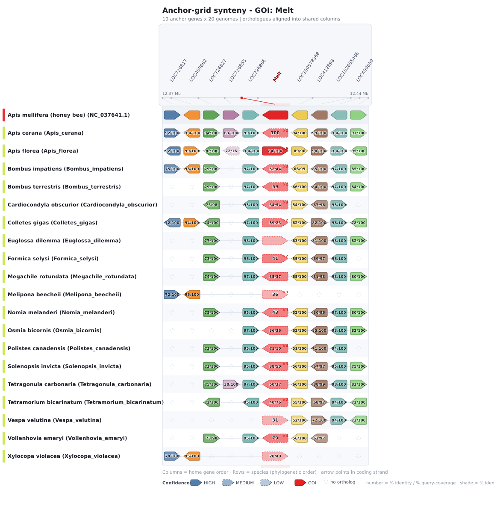

# SynVoy — Synteny Voyager

Synteny-guided discovery of divergent orthologs that sequence-similarity search misses.

[](https://github.com/AndreasWz/SynVoy/actions/workflows/test.yml)
[](https://www.gnu.org/licenses/agpl-3.0)

---

## What it does

SynVoy finds the ortholog of a gene in other species **when the gene is too divergent or too short for a normal BLAST/MMseqs2 search to find it**. Instead of matching the gene's sequence directly, it uses the gene's **neighbouring genes** — whose order tends to be conserved across species — to locate the right region in each target genome, then searches only inside that region.

It is built for **divergent, single-copy genes** (e.g. toxins, micro-exon genes). For large multi-gene families it returns ranked *candidates*, not asserted orthologs — see [Scope](#scope).

<p align="center">
  
</p>
<p align="center"><sub>Example: searching honeybee <b>melittin</b> across 19 Hymenoptera. Each row is a species; each column is a gene. The red column is the searched gene; flanking columns are its neighbours. Arrows are shaded by % identity; arrow style is confidence (solid = HIGH, dashed = MEDIUM, striped = LOW, open circle = not found). Only solid (HIGH) cells are confident orthologs; the rest are candidates to curate.</sub></p>

---

## Install

You need Linux or macOS and [conda or mamba](https://github.com/conda-forge/miniforge). Nextflow and Java are installed for you into the environment.

```bash
git clone https://github.com/AndreasWz/SynVoy.git
cd SynVoy
./install.sh
```

`./install.sh` creates the `synvoy_env` environment from `environment.yml` and checks that every tool is present. To update SynVoy later, run `git pull` from the `SynVoy` folder. Docker, Singularity, and HPC setups: [docs/INSTALL.md](docs/INSTALL.md).

---

## Run

You run SynVoy with a single command — **`./run_synvoy.sh`** — from inside the `SynVoy` folder. It checks your installation and uses laptop-safe settings by default, so it works without tuning.

First decide how you give SynVoy your data:

- **Easy Mode** — you have a gene accession, and you want SynVoy to download the genomes. *(Most common.)*
- **Pro Mode** — you have your own genome files (e.g. unpublished assemblies).

### Easy Mode

```bash
./run_synvoy.sh --mode easy --query_id P01501 --max_genomes 5 --outdir results/my_run
```

| Option | What it is |
|---|---|
| `--query_id` | A UniProt or NCBI **protein accession** for your gene (here, `P01501` = honeybee melittin). |
| `--max_genomes` | How many related species to download and search. Start with `5`. |
| `--outdir` | Where to write the results. |

SynVoy reads the species from the accession and downloads its reference genome plus related genomes automatically. Two optional flags, only if the automatic choice isn't what you want:

- `--home_species "Apis mellifera"` — name the reference species yourself. Use this if SynVoy can't read the species from your accession (it will tell you).
- `--target_species "Bombus terrestris,Nomia melanderi"` — pick the comparison species yourself instead of letting SynVoy choose related ones.

### Pro Mode

```bash
./run_synvoy.sh --mode pro \
  --query gene.faa \
  --home_genome reference.fna \
  --home_gff reference.gff \
  --target_genomes "genomes/*.fna" \
  --outdir results/my_run
```

| Option | What it is |
|---|---|
| `--query` | Your gene as a **protein FASTA** file. |
| `--home_genome` | The genome the gene comes from (FASTA). |
| `--home_gff` | That genome's **gene annotation** (a GFF3 file listing where its genes are). *Optional but recommended:* with it, SynVoy reads the real neighbouring genes; without it, it predicts them, which is less accurate. |
| `--target_genomes` | The genomes to search, as a quoted path pattern. Quote it so your shell doesn't expand it. |

### On a powerful machine

The defaults are tuned for laptops (and skip the phylogenetic tree to save memory). On a server or workstation, add `-profile standard` for full speed and the tree:

```bash
./run_synvoy.sh -profile standard --mode easy --query_id P01501 --max_genomes 10 --outdir results/my_run
```

---

## Results

Everything is written under `--outdir`. The files you will usually open:

| File | What it is |
|---|---|
| `plot_inputs_*/*.homology.tsv` | The ortholog calls, one row per target gene, with a `confidence` column. **`HIGH` = confident orthologs; `MEDIUM`/`LOW` = candidates to check.** |
| `*_anchor_grid.html` | The interactive version of the figure above (hover for details). |
| `synvoy_report.json` | A machine-readable summary of the whole run. |

A guide to every output file is in [docs/OUTPUT.md](docs/OUTPUT.md).

---

## Scope

SynVoy is for **divergent, low-copy genes** located by conserved gene order. It is validated on cases like melittin and LY6. It is **not** a general ortholog finder for large paralog families or repeat-domain superfamilies: for those, treat `MEDIUM`/`LOW` calls as leads that need manual curation, not findings. For genome-wide ortholog inference, use OrthoFinder or TOGA instead.

---

## Documentation

- [docs/QUICKSTART.md](docs/QUICKSTART.md) — a guided first run (melittin, ~20–30 min).
- [docs/OUTPUT.md](docs/OUTPUT.md) — what each output file contains.
- [docs/USAGE.md](docs/USAGE.md) — every option, all profiles, and HPC/SLURM.
- [docs/PARAMETERS.md](docs/PARAMETERS.md) — parameter tuning, with the biological reasoning.

---

## License & citation

Distributed under the **[GNU AGPLv3](LICENSE)**. If SynVoy contributes to your research, please cite:

> Weitz, F. A. SynVoy: Synteny-guided orthology discovery [Computer software]. GitHub. https://github.com/AndreasWz/SynVoy

<details>
<summary>BibTeX</summary>

```bibtex
@software{synvoy,
  author  = {Weitz, Frank Andreas},
  title   = {SynVoy: Synteny-guided orthology discovery},
  year    = {2026},
  url     = {https://github.com/AndreasWz/SynVoy},
  note    = {GitHub repository. Accessed 2026}
}
```

</details>
