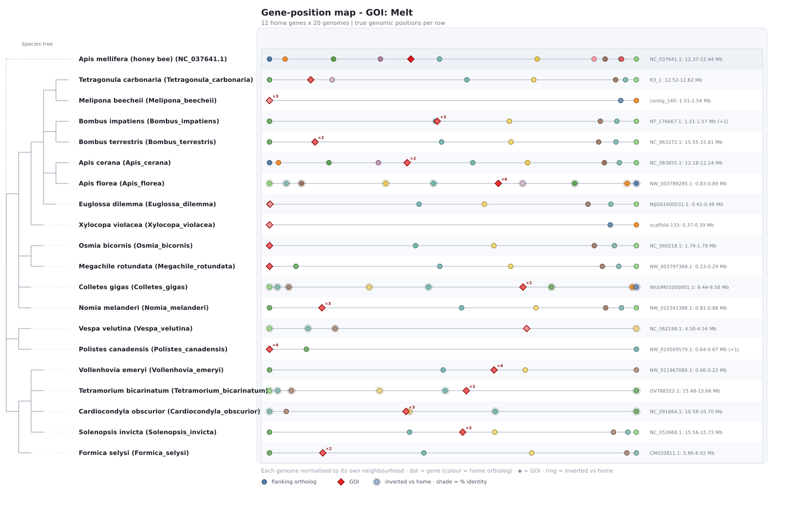
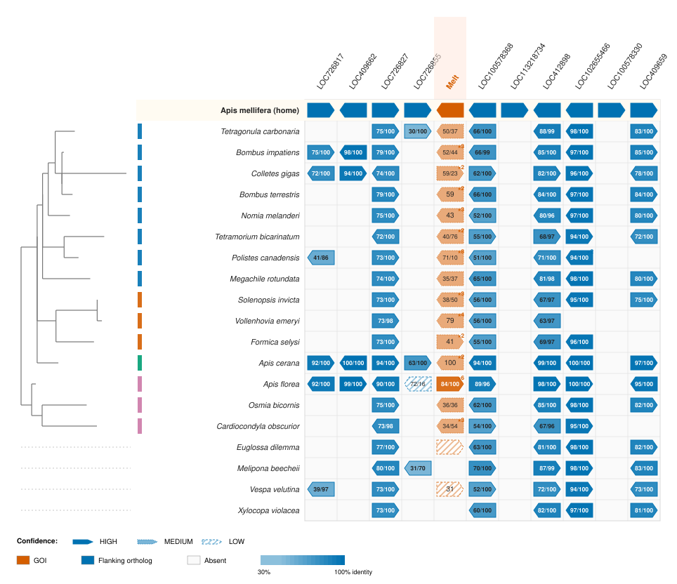

<h1 align="center">SynVoy &mdash; Synteny Voyager</h1>

<p align="center">
  <em>Find orthologous genes that BLAST can't.</em>
</p>

<p align="center">
  <a href="https://github.com/AndreasWz/SynVoy/actions/workflows/test.yml"></a>
  <a href="https://www.gnu.org/licenses/agpl-3.0"></a>
  
</p>

---

## What SynVoy does

SynVoy is a Nextflow pipeline for finding **orthologous genes across evolutionary distances** when standard sequence-similarity searches fail — e.g. on highly divergent toxins or short micro-exon genes. Instead of relying on the gene's sequence alone, it uses the **conserved order of its neighbouring genes (macro-synteny)** to locate the right genomic neighbourhood in target species, then runs a localised search inside that region.

> **Example.** Give SynVoy honeybee melittin (a UniProt accession) and a list of bee genomes. It maps melittin's flanking genes into each target to find the homologous neighbourhood, then recovers the divergent melittin orthologs that pure BLAST/MMseqs2 misses. Run against ant genomes it independently re-finds **U11-myrmicitoxin-Tb1a** (`A0A6M3Z554`) at the right locus in *Tetramorium bicarinatum* — a 26 % identity hit that homology search drops but synteny anchors.

<p align="center">
  
</p>
<p align="center"><sub><b>Anchor-grid view.</b> Each <b>row</b> is a species (NCBI-taxonomy order, tree at left); each <b>column</b> is a home-genome gene, so an orthologue reads off its vertical alignment. Cells are directional arrows shaded by % identity and labelled <code>%id / %query-cov</code>; the GOI is the red column. Arrow style = confidence (solid HIGH, dashed MEDIUM, striped LOW; open circle = not recovered).</sub></p>

<details>
<summary><b>Alternative views</b> (gene-position map &amp; synteny tracks — click to expand)</summary>

<p align="center">
  
</p>
<p align="center"><sub><b>Gene-position map</b> — each gene at its real, normalised genomic position per species (GOI as a red diamond), so rearrangements, expansions, and gaps are visible directly.</sub></p>

<p align="center">
  
</p>
<p align="center"><sub><b>Synteny track plot</b> (interactive HTML; SVG export shown) — per-locus gene-arrow tracks at real positions, with ribbons connecting orthologous flanking genes between adjacent species. The live HTML has hover tooltips, click-to-highlight orthologs, and a show/hide track manager.</sub></p>

</details>

---

## When to use SynVoy

| Scenario | Use SynVoy? |
|---|---|
| Standard tblastn / MMseqs2 already finds clean orthologs | No — you don't need it. |
| Target gene is short / micro-exon / highly divergent | **Yes** — synteny anchors the search. |
| Targets are unannotated / freshly assembled genomes | **Yes** — Pro Mode handles raw FASTA. |
| Ortholog vs. paralog resolution within a family | **Yes** — `--expand_goi_similar` puts paralogs in the tree. |
| Whole-genome ortholog inference across many species | Use OrthoFinder / TOGA — SynVoy is gene-centric. |

---

## Quick install

Requires Linux/macOS and Conda or Mamba. Nextflow and OpenJDK 17 ship inside the env.

```bash
git clone https://github.com/AndreasWz/SynVoy.git
cd SynVoy
mamba env create -f environment.yml      # or: conda env create -f environment.yml
conda activate synvoy_env
nextflow -version                         # sanity check
```

Docker/Singularity and HPC setup: **[docs/INSTALL.md](docs/INSTALL.md)**.

---

## Quick start

> **New here?** **[docs/QUICKSTART.md](docs/QUICKSTART.md)** is a 20–30 min end-to-end melittin walkthrough on NCBI-fetched bee genomes — no local data needed.

### Easy Mode — automated genome retrieval

Give an accession (or `--query` FASTA / `--query_seq` inline); SynVoy fetches the reference and target genomes and runs everything:

```bash
nextflow run main.nf \
  --mode easy --query_id Q16553 \
  --max_genomes 5 --outdir results/ly6e_easy \
  -profile standard
```

> **Unsure how to tune it?** Use `-profile auto` (same local+conda run, but it auto-picks the query preset and enables the auto-tuning stack). Small machine: `-profile auto,low_mem`.

Common overrides: `--home_species "Homo sapiens"`, `--target_species "Gallus gallus,Mus musculus"`.

### Pro Mode — local files

```bash
nextflow run main.nf \
  --mode pro --query queries/melittin.faa \
  --home_genome apis_mellifera.fna --home_gff apis_mellifera.gff \
  --target_genomes "targets/*.fna" \
  --outdir results/melittin_pro -profile standard
```

> `--home_gff` is optional but strongly recommended (much better flanking-gene extraction than Prodigal alone). Use `-resume` to restart from the last successful step.
> **Low-RAM:** add `,laptop_safe` (16 GB) or `,low_mem` (8 GB) to the profile to lower the MMseqs split-memory ceiling. See [USAGE.md § Memory tiers](docs/USAGE.md#memory-tiers-combine-with-an-execution-backend).

---

## How it works

```
query (UniProt/FASTA)
   │
   ▼
[1] Resolve & normalise query   ──►  protein FASTA
[2] Stage genomes               ──►  home + targets (Easy: auto-fetch | Pro: local)
[3] Locate GOI in home genome   ──►  tblastn + MMseqs2
[4] Extract flanking genes      ──►  n up/downstream, GOI-similar filtered
[5] Order targets by distance   ──►  closest first
[6] Per target: map flanking    ──►  syntenic blocks → localised search
                                     (tblastn + miniprot + Smith-Waterman)
[7] Cluster & score regions     ──►  rank by conserved-flank fraction
[8] Tree + plots                ──►  MAFFT + IQ-TREE, anchor grid, track plot
```

The iterative per-target search is **deterministic run-to-run** (`--deterministic_goi_search`, default on). Full algorithm details: [USAGE.md § Algorithm Overview](docs/USAGE.md#3-algorithm-overview).

---

## Output

Results land under `--outdir`. The ones you'll usually open:

| File | What it is |
|---|---|
| `plot_inputs_*/X.homology.tsv` | **Canonical per-target ortholog calls.** Filter `confidence=HIGH` for paper-quality results. |
| `plot_inputs_*/X.gff` | Per-target gene/mRNA/CDS coordinates with SynVoy attributes. |
| `regions/X.scores.tsv` | Synteny score / p-value / flanking recovery per candidate region. |
| `*_anchor_grid.html` / `.svg` | Anchor-grid view (the figure above). Auto-emitted; skip with `--no_anchor_grid`. |
| `*_synteny_plot.html` | Interactive per-locus track plot (tooltips, ortholog highlighting). |
| `*_tree.html` / `_tree.nwk` | Phylogenetic tree of GOI sequences. |
| `synvoy_report.json` | One-shot machine-readable run summary. |

Other plots (`*_gene_positions`, `*_anchor_positions`, `*_synteny_matrix`, static SVGs) and full column definitions: **[docs/OUTPUT.md](docs/OUTPUT.md)**.

---

## Further reading

- **[docs/INSTALL.md](docs/INSTALL.md)** — Setup, Docker, Singularity.
- **[docs/QUICKSTART.md](docs/QUICKSTART.md)** — End-to-end melittin walkthrough.
- **[docs/OUTPUT.md](docs/OUTPUT.md)** — Output file guide ("I want X, open Y").
- **[docs/USAGE.md](docs/USAGE.md)** — Profiles, full parameter reference, HPC/SLURM, troubleshooting.
- **[docs/PARAMETERS.md](docs/PARAMETERS.md)** — Per-parameter tuning guide with biological rationale.

---

## License & citation

Distributed under the **[GNU AGPLv3](LICENSE)**. If SynVoy contributes to your research, please cite:

> Weitz, F. A. SynVoy: Synteny-guided orthology discovery [Computer software]. GitHub. https://github.com/AndreasWz/SynVoy

<details>
<summary>BibTeX</summary>

```bibtex
@software{synvoy,
  author  = {Weitz, Frank Andreas},
  title   = {SynVoy: Synteny-guided orthology discovery},
  year    = {2026},
  url     = {https://github.com/AndreasWz/SynVoy},
  note    = {GitHub repository. Accessed 2026}
}
```

</details>

If SynVoy is useful to you, please consider starring the repo.
