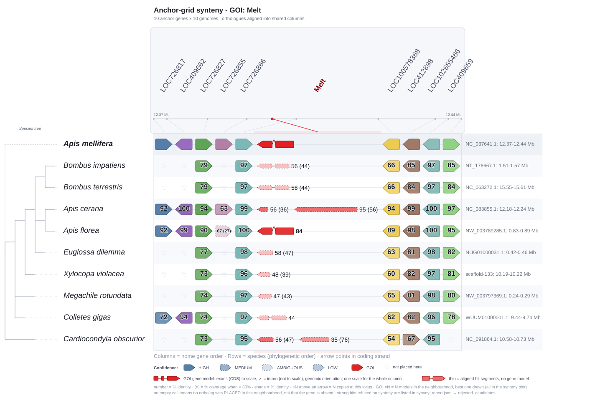

# SynVoy — Synteny Voyager

Synteny-guided discovery of divergent orthologs that sequence-similarity search misses.

[](https://github.com/AndreasWz/SynVoy/actions/workflows/test.yml)
[](https://www.gnu.org/licenses/agpl-3.0)

---

## What it does

SynVoy finds the ortholog of a gene in other species **when the gene is too divergent or too short for a normal BLAST/MMseqs2 search to find it**. Instead of matching the gene's sequence directly, it uses the gene's **neighbouring genes** — whose order tends to be conserved across species — to locate the right region in each target genome, then searches only inside that region.

It is built for **divergent, single-copy genes** (e.g. toxins, micro-exon genes). For large multi-gene families it returns ranked *candidates*, not asserted orthologs — see [Scope](#scope).

<p align="center">
  
</p>
<p align="center"><sub>Example: honeybee <b>melittin</b> searched in 19 Hymenoptera genomes. Each row is a species (the 9 with a placed call; the 10 without one are hidden), each column a gene: the searched gene in red, its neighbours either side. Numbers are % identity. The outline is the confidence — solid = HIGH, dashed = MEDIUM, pale dotted = AMBIGUOUS (in the right neighbourhood, but not shown to be the gene), striped = LOW. An empty cell means no ortholog was <i>placed</i> there, not that the gene is absent. The report for this run counts 2 HIGH and 2 MEDIUM calls and names 6 AMBIGUOUS candidates separately.</sub></p>

---

## Install

You need Linux or macOS and [conda or mamba](https://github.com/conda-forge/miniforge). Nextflow and Java are installed for you into the environment.

```bash
git clone https://github.com/AndreasWz/SynVoy.git
cd SynVoy
./install.sh
```

`./install.sh` creates the `synvoy_env` environment from `environment.yml` and checks that every tool is present. To update SynVoy later, run `git pull` from the `SynVoy` folder — do this before reporting a problem, and note the version `./run_synvoy.sh` prints, because results from different versions are not comparable in detail. Docker, Singularity, and HPC setups: [docs/INSTALL.md](docs/INSTALL.md).

---

## Run

You run SynVoy with a single command — **`./run_synvoy.sh`** — from inside the `SynVoy` folder. It checks your installation and uses laptop-safe settings by default, so it works without tuning.

First decide how you give SynVoy your data:

- **Easy Mode** — you have a gene accession, and you want SynVoy to download the genomes. *(Most common.)*
- **Pro Mode** — you have your own genome files (e.g. unpublished assemblies).

### Easy Mode

```bash
./run_synvoy.sh --mode easy --query_id P01501 --max_genomes 5 --outdir results/my_run
```

| Option | What it is |
|---|---|
| `--query_id` | A UniProt or NCBI **protein accession** for your gene (here, `P01501` = honeybee melittin). |
| `--max_genomes` | How many related species to download and search. Start with `5`. |
| `--outdir` | Where to write the results. |

SynVoy reads the species from the accession and downloads its reference genome plus related genomes automatically. Two optional flags, only if the automatic choice isn't what you want:

- `--home_species "Apis mellifera"` — name the reference species yourself. Use this if SynVoy can't read the species from your accession (it will tell you).
- `--target_species "Bombus terrestris,Nomia melanderi"` — pick the comparison species yourself instead of letting SynVoy choose related ones.

### Pro Mode

```bash
./run_synvoy.sh --mode pro \
  --query gene.faa \
  --home_species "Genus species" \
  --home_genome reference.fna \
  --home_gff reference.gff \
  --target_genomes genomes/ \
  --outdir results/my_run
```

| Option | What it is |
|---|---|
| `--query` | Your gene as a **protein FASTA** file. |
| `--home_species` | The reference species, e.g. `"Apis mellifera"` — used for taxonomy ordering. SynVoy can infer it when the `--home_genome` filename *is* the species name (e.g. `Apis_mellifera.fna`), but **stops with a clear error if it can't** (a name like `reference.fna` is not inferable). Pass it explicitly unless your filename is the species name. |
| `--home_genome` | The genome the gene comes from (FASTA). |
| `--home_gff` | That genome's **gene annotation** (a GFF3 file listing where its genes are). *Optional but recommended:* with it, SynVoy reads the real neighbouring genes; without it, it predicts them, which is less accurate. |
| `--target_genomes` | The genomes to search. Simplest: a **folder** of genome FASTAs — `genomes/` uses every `.fna`/`.fa`/`.fasta` inside it (other files like GFF/TSV are ignored). You can also pass a quoted glob (`"genomes/*.fna"`) or a comma-separated list. SynVoy stops with a clear error if it finds no genomes. |
| `--target_gffs` | *Optional.* Annotations for the **target** genomes — a second folder, glob, or comma-list. Because `--target_genomes` is FASTA-only, target GFFs go here, not alongside the genomes. With them, results tell you *which annotated gene* each hit landed on instead of only a sequence identity. Matched by filename stem or assembly accession. |

### On a powerful machine

The defaults are tuned for laptops (and skip the phylogenetic tree to save memory). On a server or workstation, add `-profile standard` for full speed and the tree:

```bash
./run_synvoy.sh -profile standard --mode easy --query_id P01501 --max_genomes 10 --outdir results/my_run
```

---

## Results

Everything is written under `--outdir`. The files you will usually open:

| File | What it is |
|---|---|
| `synvoy_report.json` | **The result.** `summary.headline` is the one-line answer; `goi_dedup.records` lists one record per gene found, with coordinates and a `confidence`: **`HIGH` / `MEDIUM` = orthologs, `AMBIGUOUS` = a candidate in the right neighbourhood that is not shown to be the gene, `LOW` (counted only) = leads.** |
| `*_anchor_grid.html` | The interactive version of the figure above (hover for details). |
| `plot_inputs_*/*.gff`, `*.homology.tsv` | Per genome: the gene models with exon coordinates, and a table of every model with its evidence. |

A guide to every output file is in [docs/OUTPUT.md](docs/OUTPUT.md).

---

## Scope

SynVoy is for **divergent, low-copy genes** located by conserved gene order. It is validated on cases like melittin and LY6, and on a benchmark of ten curated venom-gene families across 33 ant genomes: in the four near-single-copy families it recovered 30/31, 28/28, 32/32 and 31/32 of the genes that are reachable from the honeybee seed ([details](docs/NEXT_SESSION_FAMILY_BENCHMARK.md)).

Know its limits:

- It is **not** a general ortholog finder for large paralog families or tandem arrays. There, treat `MEDIUM`/`LOW` calls as leads that need manual curation, not findings. For genome-wide ortholog inference, use OrthoFinder or TOGA instead.
- It finds a gene **where the home genome's neighbourhood is conserved**. A gene that moved, or a locus the home genome does not have, is out of reach by design.
- A conserved neighbourhood does not prove the gene is still there. Where only the neighbourhood supports a call, SynVoy says `AMBIGUOUS` and does not count it.

The current state of the method, including what does not work yet, is written up in [docs/STATE_OF_THE_PROJECT.md](docs/STATE_OF_THE_PROJECT.md).

---

## Documentation

- [docs/QUICKSTART.md](docs/QUICKSTART.md) — a guided first run (melittin, ~20–30 min).
- [docs/OUTPUT.md](docs/OUTPUT.md) — what each output file contains.
- [docs/USAGE.md](docs/USAGE.md) — every option, all profiles, and HPC/SLURM.
- [docs/PARAMETERS.md](docs/PARAMETERS.md) — parameter tuning, with the biological reasoning.
- [docs/STATE_OF_THE_PROJECT.md](docs/STATE_OF_THE_PROJECT.md) — what the method is, what is validated, known weaknesses.

---

## License & citation

Distributed under the **[GNU AGPLv3](LICENSE)**. If SynVoy contributes to your research, please cite:

> Weitz, F. A. SynVoy: Synteny-guided orthology discovery [Computer software]. GitHub. https://github.com/AndreasWz/SynVoy

<details>
<summary>BibTeX</summary>

```bibtex
@software{synvoy,
  author  = {Weitz, Frank Andreas},
  title   = {SynVoy: Synteny-guided orthology discovery},
  year    = {2026},
  url     = {https://github.com/AndreasWz/SynVoy},
  note    = {GitHub repository. Accessed 2026}
}
```

</details>
